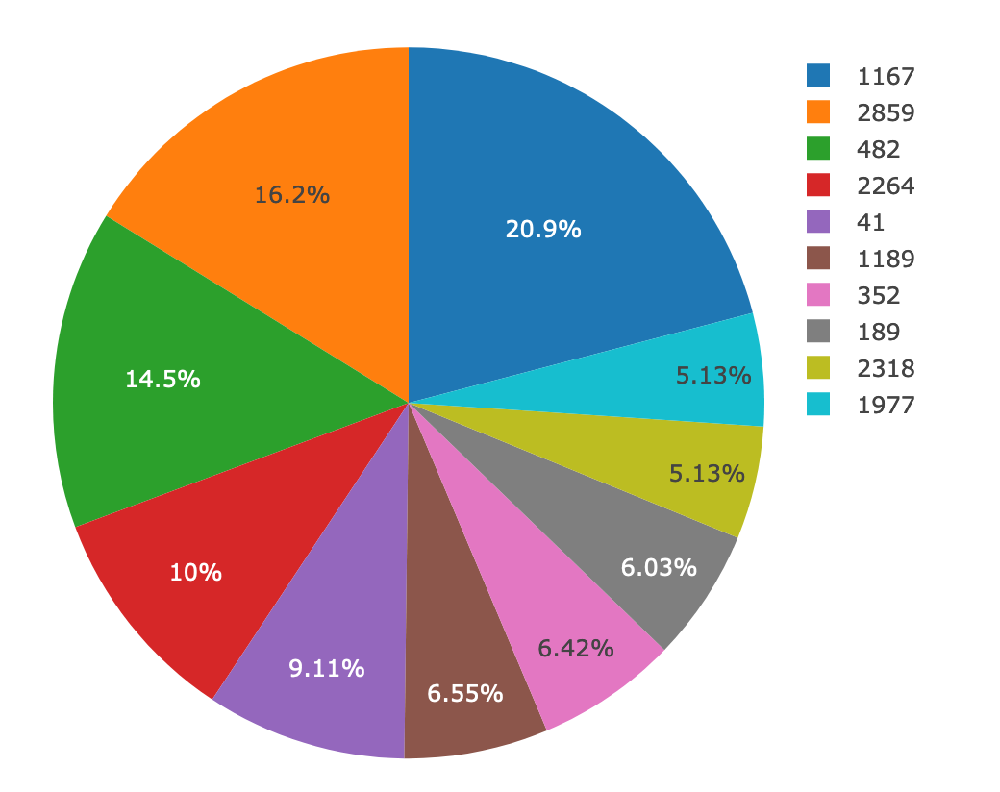

# Belly Button Biodiversity

built an interactive dashboard to explore the [Belly Button Biodiversity DataSet](http://robdunnlab.com/projects/belly-button-biodiversity/).

## Step 1 - Plotly.js

Use Plotly.js to build interactive charts for your dashboard.

* Created a PIE chart that used data from samples route (`/samples/<sample>`) to display the top 10 samples.

  * Used `sample_values` as the values for the PIE chart

  * Used `otu_ids` as the labels for the pie chart

  * Used `otu_labels` as the hovertext for the chart

  

* Created a Bubble Chart that used data from your samples route (`/samples/<sample>`) to display each sample.

  * Used `otu_ids` for the x values

  * Used `sample_values` for the y values

  * Used `sample_values` for the marker size

  * Used `otu_ids` for the marker colors

  * Used `otu_labels` for the text values

  

* Displayed the sample metadata from the route `/metadata/<sample>`

  * Displayed each key/value pair from the metadata JSON object somewhere on the page

* Updated all of the plots any time that a new sample is selected.

## Step 2 - Heroku

Deployed your Flask app to Heroku.

* You can use the provided sqlite file for the database.

- - -

## Step 3

* Adapted the Gauge Chart from <https://plot.ly/javascript/gauge-charts/> to plot the Weekly Washing Frequency obtained from the route `/wfreq/<sample>`

* modified the example gauge code to account for values ranging from 0 - 9.

* Updated the chart whenever a new sample is selected

- - -
